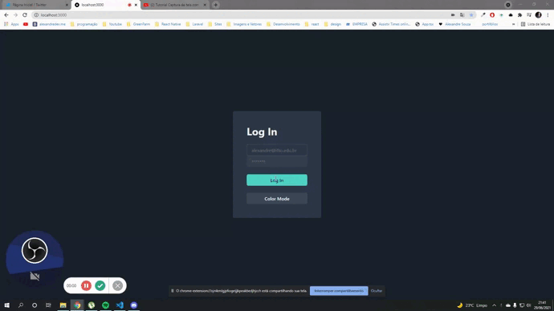

## <h1 align="center">Chakra Login with Dark mode </h1>

<p align="center">
  
</p>

## Getting Started

First, run the development server:

```bash
npm run dev
# or
yarn dev
```

## Techs
- NextJs
- Chakra UI
